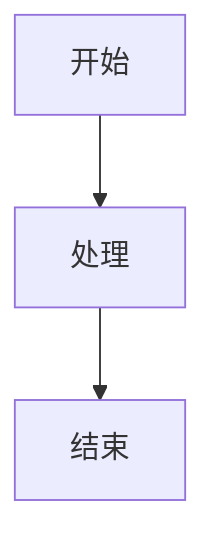

# Scholia 人工测试验收文档

**版本**：0.1.0  
**适用场景**：每次发布前、重大功能变更后执行  
**预计时长**：约 30 分钟（完整）/ 15 分钟（快速通道）

---

## 前置准备

### 测试数据

**视频内容**：至少一个 VDL 处理过的任务目录，例如：

```
~/vdl-work/
  <taskId>/
    meta.json          # 必需
    article.md         # 用于测试 AI 文章阅读
    subtitles.json     # 用于测试字幕
    media/
      video.mp4        # 可选，用于测试视频播放
```

**文章内容**：至少两个 Markdown 文件：

```
~/test-articles/
  intro.md             # 带 frontmatter（title + date）
  deep-dive.md         # 无 frontmatter，含 Mermaid 图表
  2024/sub-note.md     # 子目录，用于测试 slug 生成
```

`deep-dive.md` 示例（含 Mermaid）：

````markdown
# 深度解析

段落一内容。



段落二内容，较长，用于测试 TOC。
````

### 启动

```bash
scholia config set work-dir ~/vdl-work
scholia config set content-dir ~/test-articles
scholia serve --open
```

确认终端打印 `Scholia running at http://localhost:7654?token=...`，浏览器自动打开。

---

## 模块一：基础启动与导航

| # | 操作 | 期望结果 | 结果 |
|---|------|----------|------|
| 1.1 | 打开首页 | 显示「视频」和「文章」两个 Tab | ☐ |
| 1.2 | 切换到「视频」Tab | 显示视频卡片列表，有标题和来源 URL | ☐ |
| 1.3 | 切换到「文章」Tab | 显示文章卡片列表，有标题和日期 | ☐ |
| 1.4 | 搜索框输入关键词 | 当前 Tab 的列表实时过滤 | ☐ |
| 1.5 | 清空搜索 | 列表恢复完整显示 | ☐ |
| 1.6 | ⌘K 快捷键 | 搜索框聚焦 | ☐ |
| 1.7 | 无 Token 直接访问 `/api/tasks` | 返回 401 | ☐ |

---

## 模块二：视频详情

| # | 操作 | 期望结果 | 结果 |
|---|------|----------|------|
| 2.1 | 点击视频卡片进入详情页 | 页面正常加载，显示标题 | ☐ |
| 2.2 | 有媒体文件时 | 视频播放器显示，可点击播放 | ☐ |
| 2.3 | 无媒体文件时 | 进入 mode E（纯阅读），不显示播放器 | ☐ |
| 2.4 | AI 文章区域 | article.md 内容正常渲染 | ☐ |
| 2.5 | 字幕区域 | subtitles.json 存在时显示字幕列表 | ☐ |
| 2.6 | 视频播放时 | 当前字幕高亮，随播放进度同步 | ☐ |
| 2.7 | 点击字幕条目 | 视频跳转到对应时间戳 | ☐ |
| 2.8 | 返回首页 | 正常导航，列表保持之前状态 | ☐ |

---

## 模块三：文章详情

| # | 操作 | 期望结果 | 结果 |
|---|------|----------|------|
| 3.1 | 点击文章卡片进入详情页 | Markdown 正常渲染，无播放器 | ☐ |
| 3.2 | 含 frontmatter 的文章 | 标题显示 frontmatter 中的 title | ☐ |
| 3.3 | 无 frontmatter 的文章 | 标题从文件名推导（deep-dive → Deep Dive） | ☐ |
| 3.4 | Mermaid 图表 | 图表正常渲染，不显示为原始代码 | ☐ |
| 3.5 | TOC 导航 | 左侧或右侧显示标题列表，点击跳转 | ☐ |
| 3.6 | 子目录文章（2024/sub-note.md） | slug 正确显示为 `2024-sub-note` | ☐ |

---

## 模块四：高亮

| # | 操作 | 期望结果 | 结果 |
|---|------|----------|------|
| 4.1 | 在文章中选中一段文字 | 出现高亮操作弹窗 | ☐ |
| 4.2 | 选择黄色高亮 | 文字背景变黄，高亮持久化 | ☐ |
| 4.3 | 选择绿色高亮 | 文字背景变绿 | ☐ |
| 4.4 | 选择红色高亮 | 文字背景变红 | ☐ |
| 4.5 | 选择蓝色高亮 | 文字背景变蓝 | ☐ |
| 4.6 | 刷新页面 | 高亮仍然存在（持久化验证） | ☐ |
| 4.7 | 点击已有高亮 | 出现删除选项 | ☐ |
| 4.8 | 删除高亮 | 高亮消失，刷新后不再出现 | ☐ |
| 4.9 | 视频 AI 文章中高亮 | 同上述流程，均正常 | ☐ |

---

## 模块五：笔记

| # | 操作 | 期望结果 | 结果 |
|---|------|----------|------|
| 5.1 | 在内容中触发笔记入口 | 出现笔记输入区域 | ☐ |
| 5.2 | 输入笔记内容并保存 | 笔记绑定到当前段落/位置 | ☐ |
| 5.3 | 刷新页面 | 笔记仍然存在 | ☐ |
| 5.4 | 编辑已有笔记 | 内容更新，刷新后保持 | ☐ |
| 5.5 | 删除笔记 | 笔记消失，刷新后不再出现 | ☐ |

---

## 模块六：配置与 CLI

| # | 操作 | 期望结果 | 结果 |
|---|------|----------|------|
| 6.1 | `scholia config set work-dir ~/path` | 终端打印 `work-dir = ~/path` | ☐ |
| 6.2 | `scholia config get work-dir` | 打印设置的路径 | ☐ |
| 6.3 | `scholia config get content-dir`（未设置） | 打印 `(not set)` | ☐ |
| 6.4 | `scholia config set unknown-key val` | 打印错误信息并 exit 1 | ☐ |
| 6.5 | `scholia serve --port 8080` | 在 8080 端口启动，URL 正确 | ☐ |
| 6.6 | 端口已占用时启动 | 打印 `Port 8080 already in use.` 并退出 | ☐ |
| 6.7 | `scholia serve --open` | 浏览器自动打开 | ☐ |
| 6.8 | 未知命令 `scholia foo` | 打印 usage 并 exit 1 | ☐ |

---

## 模块七：边界与容错

| # | 操作 | 期望结果 | 结果 |
|---|------|----------|------|
| 7.1 | `work-dir` 未配置时启动 | 服务正常启动，视频列表为空（不崩溃） | ☐ |
| 7.2 | `content-dir` 未配置时启动 | 服务正常启动，文章列表为空 | ☐ |
| 7.3 | `work-dir` 指向空目录 | 视频 Tab 显示「暂无视频」 | ☐ |
| 7.4 | `content-dir` 指向空目录 | 文章 Tab 显示「暂无文章」 | ☐ |
| 7.5 | 访问不存在的任务 ID | 返回 404 或显示错误页 | ☐ |
| 7.6 | 搜索无结果 | 显示「无匹配结果」，不崩溃 | ☐ |

---

## 快速通道（回归验证，约 15 分钟）

覆盖最高风险场景，非完整测试：

- [ ] 1.1 — 首页两个 Tab 正常显示
- [ ] 2.1 + 2.4 — 视频详情 + AI 文章渲染
- [ ] 3.1 + 3.4 — 文章详情 + Mermaid 渲染
- [ ] 4.2 + 4.6 — 高亮创建并持久化
- [ ] 5.2 + 5.3 — 笔记创建并持久化
- [ ] 6.1 + 6.5 — config set + serve --port
- [ ] 7.1 — 无配置启动不崩溃

---

## 缺陷记录

| 编号 | 模块 | 步骤 | 实际结果 | 严重度 | 状态 |
|------|------|------|----------|--------|------|
| | | | | | |
